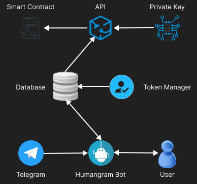

# Humangram
Humangram is a social proof of humanity plugin for
[HUMAN protocol](https://www.humanprotocol.org/).
The idea behind it is "if someone has an active social
account for a few years, chances of that account being a
bot are less."

Humangram consists of a Telegram bot and an API. The
Telegram bot helps users prove their social activity on
Telegram messenger. The API helps smart contracts fight
bots by providing humanity score with time-based
signature as proof of source.

## Workflow
Here is an overall view of how Humangram works:


* User interacts with Telegram bot
* Telegram bot interacts with the database
* Token manager manages API access
* API reads data from the database
* Private key signs API responses to prove the source
* Contract reads signed data and can check authenticity

## Live Demo
Telegram bot: [@humangram_bot](https://t.me/humangram_bot)

API base address: https://humangram.ddns.net/

API master key: `blahblahblah`

API test token: `3w3uiejcv8buvrs8gj4s1qfpvkmkyd2c`

API public key (hex):
```
ee448aee7f08ee746af3bc4463d83e3573fb12f0cd2dcfc5f223df9951eaab8dcb42c6a713d56bf0f6aa6389c775d23d0252ea8e5f9c4dc6f6a5769df07e1e23
```

API public key (pem):
```
-----BEGIN PUBLIC KEY-----
MFYwEAYHKoZIzj0CAQYFK4EEAAoDQgAE7kSK7n8I7nRq87xEY9g+NXP7EvDNLc/F
8iPfmVHqq43LQsanE9Vr8PaqY4nHddI9AlLqjl+cTcb2pXad8H4eIw==
-----END PUBLIC KEY-----
```

## Humanity Proof Score
Each user can earn humanity proof score by performing
several tasks. Currently, there are 4 optional tasks.
Scoring for each task can be modified in the config file.
Smart contracts and other verifiers may decide the
minimum acceptable score by themselves.

### Task 1 - Share phone number
By sharing their phone number, users get a one-time
score point set by `score_phone_number` in config file.
This task can be done only once by each user. Phone
numbers are not shared with verifiers.

Note that if a malicious user deletes his/her Telegram
account and signs up again in order to cheat, he/she 
can't get additional scores via sharing the same 
phone number.

### Task 2 - Forward an old message
Any user can forward a message which had been sent by
himself/herself in the past. The time of the original
message is read by the bot, and the user will receive
one score point for each `score_point_per_x_days` days
(configurable in the config file). 

Users can forward as many messages as they want to the bot.
Only the oldest message will earn them score points. The
time of the oldest message so far is saved, so if another
even older message is received in the future, the user
will only earn the difference.

### Task 3 - Proof of channel/supergroup ownership
If someone owns a popular channel/supergroup, chances of
him/her being a bot is less. Users can earn one score
point for each `score_point_per_x_members` members
(configurable in the config file). Only the admin of the
channel/supergroup can prove ownership. The minimum
recommended value for `score_point_per_x_members` is
201, because admins can add the first 200 members from
their contact list or by @usernames.

Note that each channel/supergroup can be used only once
and only by a single user. If a user has multiple
channels/supergroups, only the one with the highest
members count. The maximum members for each user is saved
and if a channel/supergroup with higher members is added
in the future, the user will only earn the difference.

### Task 4 - Getting vouched for humanity
Users can increase their score by asking other proved
humans to vouch for them. **When user A vouches for user
B, user A loses `score_voucher` score points, and user B
earns the same `score_voucher` score points.** The
amount for `score_voucher` is configurable in the config
file. This mechanism prevents the creation of vouching
clusters by malicious users.

Note than each user can vouch for each other user only
once and only if he/she can afford losing `score_voucher`
score points. Vouching requires explicit confirmation
by the voucher to prevent accidental clicks/taps.


## Quick Setup
Set up your own Humangram bot + API by following these
steps:

1) Go to [My Telegram](https://my.telegram.org/)
   and get a pair of `api_id` and `api_hash`.
2) Make a bot via [@BotFather](https://t.me/BotFather).
3) Make and activate a `venv` and install
   [requirements.txt](/requirements.txt).
4) Generate a private/public key pair (if you don't have
   one already) by issuing the command
   `python3 crypto.py`.
5) Rename [sample_config.py](/sample_config.py) to
   `config.py` and fill in the values.
6) Install **postgresql** and create `humangram` database.
7) Import [schema.sql](/schema.sql) to the database.
8) Run `python3 bot.py`.
9) Run `python3 api.py` in parallel (same `venv`).

## API Endpoints
Here is a list of API endpoints with live preview.

#### Get signed score:
`/get_score/<token>/<telegram_id>`
[[view online](https://humangram.ddns.net/get_score/3w3uiejcv8buvrs8gj4s1qfpvkmkyd2c/75149591)]

#### Get token quota:
`/get_quota/<token>`
[[view online](https://humangram.ddns.net/get_quota/3w3uiejcv8buvrs8gj4s1qfpvkmkyd2c)]

#### Generate a new token:
`/generate_token/<master_key>/<quota>`
[[view online](https://humangram.ddns.net/generate_token/blahblahblah/100)]

#### Add quota for a token:
`/add_quota/<master_key>/<token>/<quota>`
[[view online](https://humangram.ddns.net/add_quota/blahblahblah/3w3uiejcv8buvrs8gj4s1qfpvkmkyd2c/100)]

## Security Notes
* Run the API behind a reverse proxy such as Nginx using
a domain with SSL enabled. Without SSL, URLs will be sent
in plain text letting men in the middle steal tokens.
* Double-check permissions for the config file as it
contains your signing private key. The authenticity of
the whole system directly depends on that private key! 
